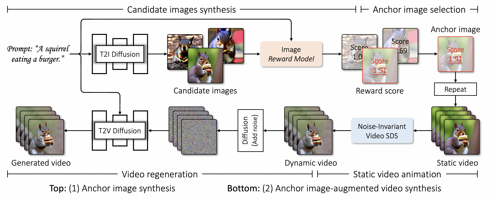

## I4VGen: Image as Free Stepping Stone for Text-to-Video Generation<br><sub>Official PyTorch implementation of the arXiv 2024 paper: https://arxiv.org/abs/2406.02230</sub>



**I4VGen: Image as Free Stepping Stone for Text-to-Video Generation**<br>
Xiefan Guo, Jinlin Liu, Miaomiao Cui, Liefeng Bo, Di Huang<br>
https://xiefan-guo.github.io/i4vgen<br>

Abstract: *I4VGen is a novel video diffusion inference pipeline to leverage advanced image techniques to enhance pre-trained text-to-video diffusion models, which requires no additional training. Instead of the vanilla text-to-video inference pipeline, I4VGen consists of two stages: anchor image synthesis and anchor image-augmented text-to-video synthesis. Correspondingly, a simple yet effective generation-selection strategy is employed to achieve visually-realistic and semantically-faithful anchor image, and an innovative noise-invariant video score distillation sampling (NI-VSDS) is developed to animate the image to a dynamic video by distilling motion knowledge from video diffusion models, followed by a video regeneration process to refine the video. Extensive experiments show that the proposed method produces videos with higher visual realism and textual fidelity.*

## Requirements

* Linux and Windows are supported, but we recommend Linux for performance and compatibility reasons.
* All experiments are conducted on a single NVIDIA V100 GPU (32 GB).

## AnimateDiff

**Python libraries:** See environment.yml for exact library dependencies. You can use the following commands to create and activate your AnimateDiff Python environment:

```.bash
# Create conda environment
conda env create -f environments/animatediff_environment.yaml
# Activate conda environment
conda activate animatediff_env
```

**Inference setup:** Please refer to the official repo of [AnimateDiff](https://github.com/guoyww/AnimateDiff). The setup guide is listed [here](https://github.com/guoyww/AnimateDiff/blob/main/__assets__/docs/animatediff.md). `mm-sd-v15-v2` and `stable-diffusion-v1-5` are used in our experiments.

| Name                  | HuggingFace                                                   | Type                      |
| --------------------- | ------------------------------------------------------------- | ------------------------- |
| mm-sd-v15-v2          | [Link](https://huggingface.co/guoyww/animatediff)             | Motion module             |
| stable-diffusion-v1-5 | [Link](https://huggingface.co/runwayml/stable-diffusion-v1-5) | Base T2I diffusion model  |

**Generating videos:**  Before generating the video, please make sure you have set up the required Python environment and downloaded the corresponding checkpoints. Run the following command to generate the video.
```.bash
python -m scripts.animate_animatediff --config configs/animatediff_configs/i4vgen_animatediff.yaml
```

In `configs/animatediff_configs/i4vgen_animatediff.yaml` and `ArgumentParser`, arguments for inference:

* `motion_module`: path to motion module, *i.e.*, `mm-sd-v15-v2` motion module
* `pretrained_model_path`: path to base T2I diffusion model, *i.e.*, `stable-diffusion-v1-5`

## LaVie

**Python libraries:** See environment.yml for exact library dependencies. You can use the following commands to create and activate your LaVie Python environment:

```.bash
# Create LaVie conda environment
conda env create -f environments/lavie_environment.yaml
# Activate LaVie conda environment
conda activate lavie_env
```

**Inference setup:** Please refer to the official repo of [LaVie](https://github.com/Vchitect/LaVie). The `base-version` is employed in our experiments. Download pre-trained `lavie_base` and `stable-diffusion-v1-4`.

| Name                  | HuggingFace                                                   | Type                      |
| --------------------- | ------------------------------------------------------------- | ------------------------- |
| lavie_base            | [Link](https://huggingface.co/Vchitect/LaVie)                 | LaVie model               |
| stable-diffusion-v1-4 | [Link](https://huggingface.co/CompVis/stable-diffusion-v1-4)  | Base T2I diffusion model  |

**Generating videos:**   Before generating the video, please make sure you have set up the required Python environment and downloaded the corresponding checkpoints. Run the following command to generate the video.
```.bash
python scripts/animate_lavie.py --config configs/lavie_configs/i4vgen_lavie.yaml
```

In `configs/lavie_configs/i4vgen_lavie.yaml` and `ArgumentParser`, arguments for inference:

* `ckpt_path`: path to LaVie model, *i.e.*, `lavie_base` 
* `sd_path`: path to base T2I diffusion model, *i.e.*, `stable-diffusion-v1-4`

## Citation

```bibtex
@article{guo2024i4vgen,
    title   = {I4VGen: Image as Free Stepping Stone for Text-to-Video Generation},
    author  = {Guo, Xiefan and Liu, Jinlin and Cui, Miaomiao and Bo, Liefeng and Huang, Di},
    journal = {arXiv preprint arXiv:2406.02230},
    year    = {2024}
}
```

## Acknowledgments

The code is built upon [AnimateDiff](https://github.com/guoyww/AnimateDiff) and [LaVie](https://github.com/Vchitect/LaVie), we thank all the contributors for open-sourcing.